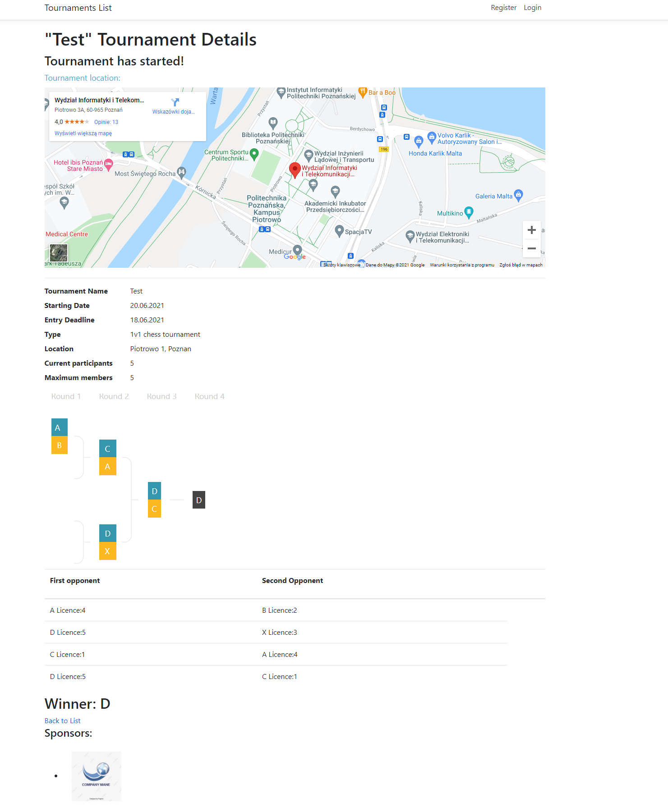

# Online tournament system web application

## Simple web application that allows user to:
* Create own account
* Create tournament
* Enroll to existing tournament
* See incoming matches
	

## Project is created with:
* .NET Core 5.0
* ASP.NET
* Entity Framework
* https://github.com/erik5388/jquery.gracket.js
	
